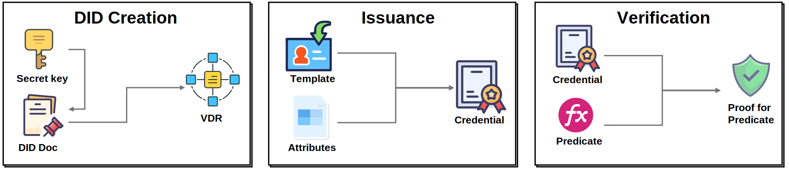

## Web3 Platform

### Overview

PolyuDID is an open-source decentralized identity infrastructure revolutionizing Web3 privacy through AI-powered anonymous credentials. As the first platform combining zero-knowledge proofs, BBS+ signatures, and LLM intelligence, we enable truly user-controlled digital identities with cryptographic privacy guarantees. Our modular system empowers developers to build compliant Web3 applications while ensuring complete transaction unlinkability, dynamic credential management, and minimal data exposure through selective disclosure capabilities.

### Open-Source Architecture

PolyuDID's modular design supports multi-role participation through three core components:

- **Credential Management Platform:** Enables institutions to issue privacy-preserving credentials with ZKP-enabled selective disclosure capabilities, supporting multiple revocation models
- **Identity Wallet:** Allows users to create self-sovereign identities, manage credentials locally, and conduct unlinkable authentication through decentralized identifiers (DIDs)
- **Verifier SDK:** Provides developers with plug-and-play modules for credential verification, featuring blockchain status checks and privacy-preserving proof verification

Our open-source middleware supports custom extensions while maintaining interoperability through W3C-compliant standards.

### Next-Gen Intelligent Privacy Stack

PolyuDID introduces groundbreaking technical capabilities:

- **World's First LLM-Powered Credential Engine:** Transform natural language requirements into standardized credential templates with automatic cryptographic parameter configuration
- **Advanced Privacy Stack:** Combines zk-SNARKs for selective disclosure with BBS+ signatures for multi-show unlinkability, achieving military-grade privacy
- **Dynamic Credential Ecosystem:** Supports time-bound credentials, delegated issuance, and cross-chain revocation status synchronization

### Links and Resources  

- **Project Website:** [PolyuDID](https://111.230.179.154/)  
- **GitHub Repository:** [CXYALEX/DIDSYSTEM](https://github.com/CXYALEX/DIDSYSTEM)  